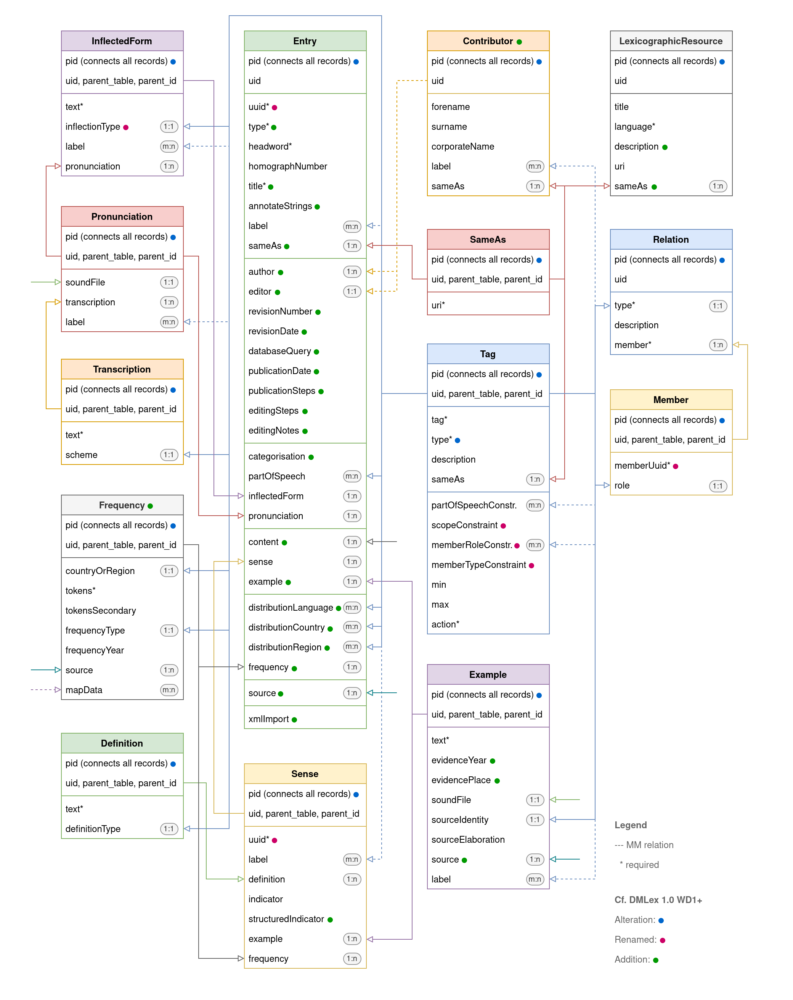

# DA Lex

- Description: Create and manage lexicographic data in TYPO3
- Author: Jonatan Jalle Steller ([jonatan.steller@adwmainz.de](mailto:jonatan.steller@adwmainz.de))
- Requirements: `typo3/cms-core` 12
- License: GPL 3
- Version: 0.0.2

This TYPO3 extension for lexicographic resources implements the [DMLex data model](https://www.oasis-open.org/committees/lexidma), version 1.0 WD1. It includes the two official modules Controlled Vocabulary and Linking, as well as a custom Editorial module and in-line annotations. In addition to the data model, the extension also provides extensible [TEI Lex-0](https://dariah-eric.github.io/lexicalresources/pages/TEILex0/TEILex0.html) and [OntoLex Lemon](https://www.w3.org/2019/09/lexicog/) serialisations provided through a REST endpoint based on a specification from the EU-funded Elexis project. In addition to the focus on dictionary entries, the extension also provides encyclopedic articles and glossary entries as additional data types.

## Setup

1. Install the extesion.
2. Add a `LexicographicResource` to a data folder that will hold all lexicographic data connected to this resource.
3. Optionally set up a task to periodically ingest data from a remote location.

If you need to set up multiple lexicographic resources, simply set up multiple data folders and add a `LexicographicResource` to each of them.

## Usage

TBD

## Development

TBD

## Data model

All records of a single `LexicographicResource` are held together by using the same page ID (PID). The core class `Entry` may have the types "Dictionary entry," "Encyclopedia entry," or "Glossary entry." This choice restricts which fields are exposed for editing. The `Entry` has a number of dependent classes that provide information that may be needed multiple times per entry: `Sense`, `Definition`, `InflectedForm`, `Pronunciation`, and `Transcription`. An additional `Contributor` class is employed to name authors and editors of entries. The data model does not have a separate class for headwords, which are simply organised using an entry's `headword` property. A `Frequency` class may be attached to either an `Entry` or a `Sense` in order to provide the number of tokens from a specified dataset, and can be connected to a `MapData` class from the [DA Map](https://gitlab.rlp.net/adwmainz/digicademy/t3xdev/da-map) extension. To provide information about how entries of all types interconnect, the class `Relation` lets you choose a type of relation you want to model and add as many `Member`s as you like. In addition, the model knows flexible `Tag`s and `SameAs` classes, which can be used to group entries andor contributors via labels, to add various types across the previous classes, and to connect entities to Linked Open Data. Across the data model, a `Reference` from the [DA Bib](https://gitlab.rlp.net/adwmainz/digicademy/t3xdev/da-bib) extension may be used to identify sources.

## Roadmap

- Remove page code, possible error in ext_localconf.php line 65
- Add the data model
- Add documentation for frontend template
- Add TEI Lex-0 and OntoLex Lemon
- Add testing
